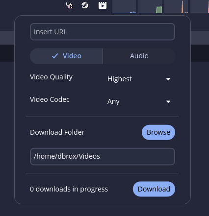

# Yt-dlp Cosmic Applet

A simple yt-dlp GUI for the COSMIC DE



## Installation 

Clone the repository:

```bash
git clone https://github.com/D-Brox/cosmic-ext-applet-yt-dlp cosmic-ext-applet-yt-dlp
cd cosmic-ext-applet-yt-dlp
```

Build and install the project:

```bash
just build-release
sudo just install
```

For alternative packaging methods, use the one of the following recipes:

- `deb`: run `just build-deb` and `sudo just install-deb`
- `rpm`: run `just build-rpm` and `sudo just install-rpm`

For vendoring, use `just vendor` and `just vendor-build`

## Contributing

A [justfile](./justfile) is included with common recipes used by other COSMIC projects:

- `just build-debug` compiles with debug profile
- `just run` builds and runs the application
- `just check` runs clippy on the project to check for linter warnings
- `just check-json` can be used by IDEs that support LSP

## License

Code is distributed with the [GPL-3.0-only license][./LICENSE]

